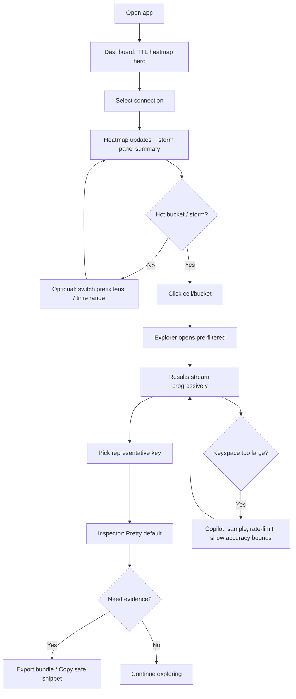

# UX Design Specification cachify-studio

**Author:** Jay
**Date:** 2026-02-08T15:08:43+07:00

---

<!-- UX design content will be appended sequentially through collaborative workflow steps -->

## Executive Summary

### Project Vision

Cachify-studio is a premium, offline-first desktop cache client designed to make “fast, safe understanding” the default. The product’s emotional center is calm confidence under pressure: connect quickly, find the right key fast, decode values safely, and avoid production mistakes through unmistakable trust cues and read-only defaults.

### Target Users

- Software engineers who debug caches daily and need speed without fear.
- On-call or SRE-adjacent users who need clarity and guardrails in high-stakes moments.
- Security-minded developers who care about redaction, credential safety, and auditability.

### Key Design Challenges

- Make time-to-understanding consistently under one minute without exposing secrets.
- Keep the UI calm and readable during incident pressure while avoiding dangerous actions.
- Support mixed expertise levels with progressive disclosure: safe by default, powerful when needed.

### Design Opportunities

- Trust-first UX: persistent environment cues and a visible trust chip that prevent wrong-env mistakes.
- Decode-first value understanding: pipelines (base64 → gzip → JSON) and prefix-based viewer profiles that make opaque payloads instantly legible.
- Incident-ready sharing: redacted, context-rich exports that are safe for tickets and screen shares.

## Core User Experience

### Defining Experience

Cachify-studio’s core experience is “instant orientation → instant understanding”.

The primary loop starts with a Spotlight-like jump-in that drops the user directly into the right context (connection, recent key, or search). From there, the user’s daily engine is fast key discovery and safe value understanding: search/prefix → inspect with metadata (type/size/TTL) → decode pipeline → redaction-by-default → copy/export evidence.

Safety is always present but intentionally quiet: environment/trust cues are continuously visible, production defaults to read-only, and mutation is an explicit, time-boxed “unlock” layer that is hard to do by accident.

### Platform Strategy

- Cross-platform desktop app: macOS, Windows, Linux.
- Input model: keyboard + mouse first (keyboard-forward for speed and fluency).
- System integration: global shortcut to focus search; tray menu for quick access and mode visibility.
- Offline-first posture: app state stored locally; no backend required; fetched cache values are not persisted by default; sharing happens via explicit export.

### Effortless Interactions

- Jump-in without thinking: global shortcut → search field focused → immediate results.
- Find the right thing fast: connection search + recent/favorites + saved searches/prefix shortcuts.
- Understand messy data safely: decode pipeline is obvious, fast, and reversible; redaction is the default; “safe reveal” is deliberate.
- Share without fear: copy/export produces a redacted, context-rich artifact (env/key/TTL/decode) suitable for tickets and screen share.
- Never freeze the UI: progressive loading, cancellation, and safety caps for large keyspaces/values with clear escape hatches (export raw/partial).

### Critical Success Moments

- The 10-second moment: user instantly knows “where am I?” (env + trust + read-only state are unmistakable).
- The 60-second moment: user finds the right key and sees a correctly decoded, safely redacted value without UI lockups.
- The “no foot-guns” moment: user attempts a mutation in a risky context and the product makes intent explicit (unlock flow) and prevents accidental damage.

### Experience Principles

- Search-first, always-ready: the fastest path starts from a single focused command surface.
- Clarity over completeness: show the minimum high-signal UI by default; reveal power features progressively.
- Safe by default, deliberate by choice: read-only in prod, redaction by default, explicit unlock for mutations.
- Never block the user’s flow: performance guardrails, progressive results, and graceful degradation are part of UX.
- Make sharing a first-class outcome: every investigation should end with a safe, portable artifact.

## Desired Emotional Response

### Primary Emotional Goals

- Calm and focused: the UI should reduce cognitive load, especially under time pressure.
- Confident and in control: users should always understand where they are (env), what’s safe (read-only), and what will happen next.

### Emotional Journey Mapping

- First discovery / first run: “This feels safe and professional” (trust begins immediately).
- Connecting to an environment: calm certainty (“I can see this is staging/prod and what mode I’m in”).
- Searching and inspecting: flow state (“I’m moving fast and not second-guessing”).
- Decoding and understanding: small delight (“it just made that blob make sense”) without feeling gimmicky.
- Sharing/exporting: relief (“I can paste this into a ticket without leaking secrets”).
- When something goes wrong (auth fails, value too large, scan slow): calm copilot (“here’s what happened, here are the safest next actions”).

### Micro-Emotions

- Trusting: the product continuously earns trust through transparent posture and predictable behavior.
- Relief: guardrails prevent foot-guns and UI lockups; safe defaults remove fear of mistakes.
- Delighted (selectively): decoding, formatting, and “evidence-ready” sharing feel surprisingly smooth.
- Emotions to avoid: confusion (unclear state or meaning) and anxiety (wrong-env fear, sharing fear, performance fear).

### Design Implications

- Prevent anxiety with constant clarity: persistent trust chip + unmistakable environment cues + always-visible safety mode.
- Maintain control through deliberate actions: read-only by default in prod; explicit, time-boxed unlock for mutations with unmissable state change.
- Reduce confusion in data views: type/size/TTL and decode pipeline are visible and explainable; “what am I seeing?” is answered in the UI.
- Make failures feel guided, not punishing: errors provide a short diagnosis + next-best safe actions (retry, test connection, adjust scan scope, export partial).
- Preserve calm during heavy operations: progressive results, cancellation, and clear “safety cap reached” states with escape hatches.

### Emotional Design Principles

- Calm surfaces, fast outcomes: minimal chrome, high-signal defaults, and rapid time-to-understanding.
- Make state visible at all times: environment, trust, and mutation-readiness are never hidden.
- Safety by default, power by intent: advanced actions require explicit intent; normal work stays frictionless.
- Copilot recovery over dead ends: every failure state offers a safe next step.
- Delight only where it builds confidence: decoding and sharing are the “pleasant surprises”, not animations or clutter.

## UX Pattern Analysis & Inspiration

### Inspiring Products Analysis

**Notion (UI simplicity)**

- Core strength: calm information hierarchy with low visual noise.
- Pattern to learn: a stable left-rail + content canvas that supports deep work without feeling “dashboard-y”.
- Behavior to emulate: progressive disclosure (details appear when needed), consistent typography, generous spacing, and predictable interaction surfaces.

**Postman (results in any encoding)**

- Core strength: the same data can be understood through multiple lenses without losing fidelity.
- Pattern to learn: “viewer modes” (e.g., pretty/raw/preview-like options) and clear, inspectable metadata about what you’re seeing.
- Behavior to emulate: fast switching between representations, clear defaults, and confident handling of edge cases (unknown formats, large payloads, errors) without breaking flow.

### Transferable UX Patterns

- Calm layout and hierarchy (from Notion): stable navigation + focused main panel + minimal chrome.
- Progressive disclosure: show high-signal defaults first; reveal deep controls and raw views only when requested.
- Multi-view inspector (from Postman): multiple representations of the same underlying value (raw, formatted, decoded stages).
- “What am I looking at?” affordances: visible metadata and clear viewer state so users never feel lost.
- Failure states as guidance: inline explanations plus next-best actions rather than dead-end errors.

### Anti-Patterns to Avoid

- Dense, noisy “enterprise console” UIs that spike cognitive load during incidents.
- Hiding critical state (environment, read-only/unlocked mode) behind tabs or settings.
- Overusing modals for core work (breaks flow and increases anxiety).
- Making dangerous actions feel casual (tiny buttons, ambiguous confirmation, unclear blast radius).
- Presenting decoded/pretty views without an easy path back to raw truth (undermines trust).

### Design Inspiration Strategy

**What to Adopt**

- Notion’s calm, simple hierarchy to support “calm and focused”.
- Postman’s inspector mindset: make representations explicit (raw vs decoded vs formatted) to build “confident and in control”.

**What to Adapt**

- Postman’s “response viewers” into a cache value “decode pipeline” viewer (stage-by-stage, reversible, with visible limits and redaction).
- Notion’s simplicity into a three-surface app (Dashboard / Explorer / Playbooks) with drawers for connection, trust, and policy detail.

**What to Avoid**

- Visual clutter and state ambiguity that create confusion/anxiety.
- Power features exposed by default that increase foot-gun risk or slow down time-to-understanding.

## Design System Foundation

### 1.1 Design System Choice

**Themeable, token-driven custom system using TailwindCSS + headless UI primitives (Radix-style), plus a small curated component set.**

This is not “use a premade UI kit”; it’s “use proven accessible primitives, then express our own calm visual language through tokens and a tight component inventory.”

### Rationale for Selection

- **Uniqueness is the priority:** Tailwind + tokens lets us build a Notion-simple, Claude-elegant aesthetic without inheriting Material/Ant visual DNA.
- **Desktop UX needs precision:** we can tune density, typography, and focus states for keyboard-first workflows.
- **Safety + trust cues require custom components:** trust chip, environment coloring, decode pipeline viewer, and “unlock mutations” states should be bespoke.
- **Accessibility and consistency:** headless primitives reduce risk for dialogs, menus, combobox/search, tooltips, and focus management.

### Implementation Approach

- **Tailwind as the design token engine:** define semantic tokens (color, surface, border, text, focus, danger, env states) and enforce usage across the app.
- **Headless primitives for complex interactions:** dialogs/drawers, command palette, menus, tooltips, tabs, toasts, tables/virtual lists.
- **Curated component inventory:** build only what we need for the three surfaces (Dashboard / Explorer / Playbooks) and keep components composable and minimal.
- **Keyboard-first contract:** every component must support clear focus rings, predictable shortcuts, and fast navigation.

### Customization Strategy

- **Aesthetic direction:** calm, warm-neutral surfaces; soft borders; restrained color; strong typography hierarchy; generous spacing (Notion) with “quiet polish” (Claude).
- **Signature components (bespoke):**
  - Trust chip + environment color system (always visible)
  - Value inspector with decode pipeline stages (Postman-inspired)
  - Safe reveal + redaction states
  - Read-only / unlocked mutations mode shell (unmissable state changes)
- **Density modes:** “Comfort” and “Compact” as first-class tokens (spacing + type scale + row height).

## 2. Core User Experience

### 2.1 Defining Experience

**Decode any cache value into meaning, safely, in seconds.**

The experience is optimized around turning opaque cache payloads into something a developer can immediately reason about. Users should be able to jump into the app, land in the right connection context, find the relevant key quickly, and see a “Pretty” decoded view by default, with a one-tap escape hatch to “Raw” for truth and trust.

### 2.2 User Mental Model

Users think in **connections first**: “Which cache am I looking at?” before “Which key/prefix?”. The UI should therefore make connection selection/search the first-class axis of orientation, and then progressively narrow to key discovery and inspection.

### 2.3 Success Criteria

Within 60 seconds, the user should reliably be able to:

- Choose the right connection (quickly, with unmistakable trust/environment cues).
- Find the right key fast (search/prefix workflows with responsive results).
- See a correctly decoded value representation (Pretty by default) that makes meaning obvious.

### 2.4 Novel UX Patterns

This product should primarily use **established patterns** (Notion-like calm hierarchy, Postman-like inspector viewers) but combine them in a way that feels uniquely “prod-safe + decode-first”.

The value inspector should present decoding through **familiar viewer modes**:

- **Pretty** (default): the safest, most legible representation available.
- **Raw**: faithful raw representation, always one click away to preserve trust and reduce ambiguity.

Advanced decoding “pipeline” detail can still exist, but as progressive disclosure behind the viewer (e.g., “How was this decoded?”), rather than the primary interaction model.

### 2.5 Experience Mechanics

**1. Initiation**

- User triggers the global shortcut.
- The **full app** comes to the foreground and the search field is focused immediately.
- The UI shows current connection context and trust state without requiring navigation.

**2. Interaction**

- User selects/searches a connection (connections-first mental model).
- User searches for a key or prefix and opens a result.
- User lands in an inspector with metadata visible (type/size/TTL) and the value in **Pretty** view by default.

**3. Feedback**

- Search gives immediate feedback (loading/progressive results) and is cancelable.
- Inspector clearly indicates: connection + environment, view mode (Pretty/Raw), and decode status (success/partial/limited).
- When limits are hit (too large / too slow), the product stays calm and offers safe next actions (export raw/partial, narrow scope).

**4. Completion**

- User reaches understanding (meaningful decoded view) and can copy/export a redacted, context-rich artifact.
- If needed, user can switch to Raw to verify truth, then return to Pretty for comprehension.

## Visual Design Foundation

### Color System

**Approach**

- Support **Light** and **Dark** modes, defaulting to **system preference**.
- Use **semantic tokens** (not raw hexes in components) so the UI stays consistent and evolvable.
- Environment/safety state must be communicated with **label + icon + color** (never color alone).

**Theme Direction: Ink + Terracotta (Unique but calm)**

Light (base palette)

- Background: `#FCFCFD`
- Surface: `#FFFFFF`
- Surface 2 (subtle tint): `#F7F7F9`
- Border: `#E5E7EB`
- Text (primary): `#111827`
- Text (muted): `#6B7280`
- Accent (terracotta): `#E65D2E`
- Focus ring: accent @ 40–60% alpha (always visible on light surfaces)

Dark (base palette)

- Background: `#0B0F14`
- Surface: `#0F1620`
- Surface 2: `#121C28`
- Border: `#223041`
- Text (primary): `#E5E7EB`
- Text (muted): `#9CA3AF`
- Accent (terracotta): `#FF7A45` (slightly lifted for contrast)
- Focus ring: accent @ 50–70% alpha (avoid low-contrast “thin blue rings”)

**Semantic tokens (examples)**

- `--bg`, `--surface`, `--surface-2`, `--border`
- `--text`, `--text-muted`
- `--accent`, `--accent-contrast`
- `--danger`, `--warning`, `--success`
- `--prod`, `--staging`, `--local` (used sparingly, always with labels)

**Environment cues (consistent across modes)**

- Local: green family
- Staging: amber/orange family
- Prod: red family (unmistakable)
- Always show environment as a **trust chip**: text label + small icon + color accent.

### Typography System

**Goals**

- Calm readability, compact density, and “developer trust” (keys and values must look precise).

**Typeface choices**

- UI sans: a clean, modern sans (system or a single bundled sans) optimized for readability.
- Mono: a dedicated monospace for keys, commands, raw views, and metadata (prevents ambiguity).

**Type scale (compact-first)**

- Base body: 13–14px with comfortable line-height (1.4–1.5).
- Navigation labels: 12–13px, medium weight for clarity.
- Section headings: restrained (avoid oversized headings; hierarchy comes from spacing + weight).
- Code/value panes: 12–13px mono with clear glyph distinction.

### Spacing & Layout Foundation

**Density**

- Default: **Compact**.
- Use a 4px spacing unit and keep interactive targets comfortable via padding, not font size.

**Layout principles**

- Stable left rail + focused content canvas (Notion-like calm).
- Drawers/panels for secondary detail (connection, trust/policy, inspector) to avoid modal overload.
- Tables/lists optimized for scanning: strong row alignment, subtle separators, predictable columns.

**Interaction sizing (guidelines)**

- List rows: ~28–32px height in Compact.
- Buttons/controls: compact variants with clear focus and disabled states.
- Value/inspector panes: favor legibility and copyability; avoid visual noise.

### Accessibility Considerations

- Keyboard-first: visible focus ring, predictable tab order, shortcut discoverability.
- Contrast: meet strong contrast for text on surfaces in both themes; avoid “low-contrast aesthetic” failures.
- Color reliance: environment/safety states always include text + icon + placement, not just hue.
- Reduced motion: respect system “reduce motion” and keep animations subtle/functional.

## Design Direction Decision

### Design Directions Explored

We explored multiple directions within the Ink + Terracotta foundation (compact, system light/dark), including:

- Calm Canvas (Notion-like hierarchy)
- Command-first workflow surface
- Inspector-first (Postman-style viewer)
- TTL Heatmap Hero (dashboard-first orientation)
- Playbooks runner (safe recipes + outputs)
- Prod-safe shell (state never subtle)
- Dense key table (scan/sort/filter)
- Zen inspector (distraction-free understanding)

### Chosen Direction

**TTL Heatmap Hero (Dashboard-first orientation)**

The dashboard leads with a calm, high-signal TTL visualization (heatmap) that helps users quickly spot risk patterns (e.g., synchronized expiries / “storms”) and click-to-drill into Explorer with the correct connection + prefix context already applied.

### Design Rationale

- Supports “calm and focused” by turning a complex problem into a quiet, glanceable signal.
- Supports “confident and in control” by making risk and context visible before the user starts clicking keys.
- Reinforces “meaning in seconds” by driving users directly to the right subset of keys (prefix + time bucket) instead of broad scans.
- Plays well with prod safety: the dashboard can remain read-only and still be deeply useful under pressure.

### Implementation Approach

- Dashboard surface includes TTL heatmap + a compact “storm panel” summarizing what changed and safe next actions.
- Heatmap interactions:
  - Click a cell/bucket → open Explorer pre-filtered (connection + prefix + TTL bucket filter).
  - Provide safe sampling + rate limits for large keyspaces; show accuracy bounds.
- Explorer remains the engine for decoding values (Pretty default, Raw always available) and evidence export.
- Playbooks integrate as suggested next steps from dashboard signals (“Investigate stampede”, “Export evidence”, “Open key list”).

## User Journey Flows

### Incident Investigation + Shareable Artifact (Bundle-First)

Goal: produce a redacted, context-rich artifact that teammates can trust and act on.

```mermaid
flowchart TD
  A[Start: user opens app (on-call)] --> B[Dashboard opens]
  B --> C{Storm / anomaly visible?}
  C -->|Yes| D[Select connection context]
  C -->|No| E[Choose connection (connections-first)]
  D --> F[Inspect TTL heatmap + storm panel]
  E --> F
  F --> G{Need drilldown?}
  G -->|Yes| H[Click heatmap bucket]
  H --> I[Explorer opens pre-filtered (connection + prefix + TTL bucket)]
  G -->|No| J[Run read-only playbook: \"Is cache the culprit?\"]
  J --> K[Playbook outputs evidence (redacted)]
  I --> L[Pick key from results]
  L --> M[Inspector opens: Pretty default]
  M --> N{Need Raw truth?}
  N -->|Yes| O[Switch to Raw]
  N -->|No| P[Continue in Pretty]
  O --> Q[Return to Pretty]
  P --> R[Generate bundle: Markdown (redacted) + provenance]
  Q --> R
  R --> S[Export / Copy safe snippet]
  S --> T[Done: attach to ticket / share]
  
  %% Recovery paths
  I --> U{Scan slow / huge keyspace?}
  U -->|Yes| V[Copilot suggests: narrow prefix / sample / cancel]
  V --> I
  M --> W{Value exceeds safety caps?}
  W -->|Yes| X[Show partial preview + options: export raw/partial]
  X --> R
  D --> Y{Auth/TLS/SSH fail?}
  Y -->|Yes| Z[Copilot: show reason + fix steps + retry]
  Z --> D
```

### Fast Debug (Connect → Find → Understand → Share)

Goal: decode any cache value into meaning safely in seconds.

```mermaid
flowchart TD
  A[Trigger global shortcut] --> B[Full app foreground + search focused]
  B --> C[Select/search connection]
  C --> D{Connection ok?}
  D -->|No| E[Copilot error: diagnose + retry/fix]
  E --> C
  D -->|Yes| F[Key search: fuzzy + prefix shortcuts]
  F --> G[Select key]
  G --> H[Inspector opens]
  H --> I[Pretty view default (decoded + redacted)]
  I --> J{Meaning achieved?}
  J -->|Yes| K[Copy safe snippet / Export MD]
  J -->|No| L[Switch to Raw for truth]
  L --> M[Adjust decode/viewer (or accept raw)]
  M --> I
  
  %% Safety caps
  I --> N{Too large / too deep?}
  N -->|Yes| O[Show cap reached + export raw/partial]
  O --> K
```

### TTL Heatmap → Drilldown (Dashboard Hero Flow)

Goal: convert high-level risk signal into a targeted investigation quickly.



### Journey Patterns

- Connections-first orientation: choose cache context before key-level work.
- Always-visible trust state: environment + read-only/unlocked are continuously legible.
- Inspector viewer modes: Pretty default, Raw one-click away for trust.
- Calm-copilot recovery: every failure state offers safe next actions (retry, narrow scope, export partial).

### Flow Optimization Principles

- Minimize time-to-understanding: global shortcut → focused search → first meaningful decode.
- Prefer drilldown over broad scans: dashboard signals → filtered explorer.
- Keep the UI responsive: progressive results, cancelation, safety caps with escape hatches.
- Make sharing an outcome: every investigation can end in a redacted, provenance-stamped artifact.

## Component Strategy

### Design System Components (shadcn/ui on Base UI + Tailwind)

**Foundation principle:** components use semantic tokens (light/dark, compact density) and must be keyboard-first.

Core primitives/components we will rely on:

- Button, IconButton, Badge, Separator
- Input, Textarea, Select, Switch, Checkbox, Slider (for caps/limits)
- Tabs (Pretty / Raw viewer)
- Dialog (confirmations, unlock flows), Sheet/Drawer (inspector, connection details), Popover, Tooltip
- DropdownMenu / ContextMenu (key actions)
- Command surface (⌘K search) as a first-class component
- Toast/Notifications (non-blocking feedback)
- Table/List building blocks (with optional virtualization)
- Skeleton/Progress, EmptyState, Alert/Callout

### Custom Components

#### TrustChip (Environment + Safety State)

**Purpose:** persistent orientation; prevent wrong-env anxiety.  
**Usage:** always visible in app chrome + inspector.  
**Anatomy:** env label, lock/read-only state, connection identity hint, optional transport indicator.  
**States:** local/staging/prod; read-only; unlocked; degraded (tunnel/TLS issues).  
**Accessibility:** readable text (not color-only), focusable when it opens details.

#### ConnectionSwitcher (Connections-First Selector)

**Purpose:** make “right connection chosen” fast and safe.  
**Usage:** ⌘K + sidebar list + quick switcher.  
**States:** recent/favorites, search results, offline/unreachable, auth-required.  
**Behavior:** highlights env; blocks risky actions in prod by default.

#### TTLHeatmap (Dashboard Hero)

**Purpose:** calm, glanceable risk signal; “storm” detection.  
**Usage:** Dashboard default module.  
**Anatomy:** prefix lens, time range, bucket legend, accuracy bounds indicator.  
**States:** loading, partial (sampling), empty, error, degraded (rate-limited).  
**Interaction:** click cell → open Explorer pre-filtered (connection + prefix + TTL bucket).

#### StormPanel (Copilot Summary + Safe Next Actions)

**Purpose:** turn signal into action without panic.  
**Usage:** beside/under heatmap.  
**Content:** “what changed”, confidence, top hypotheses, safe next actions (RO playbooks, drilldown).  
**States:** no storm, storm detected, uncertain, stale data.

#### ExplorerFilters (Prefix / Query / Limits)

**Purpose:** keep big keyspaces safe and responsive.  
**Behavior:** shows active filters; encourages narrowing; exposes sampling toggles.  
**States:** default, advanced, policy-restricted.

#### KeyResultsList (Streaming + Optional Virtualization)

**Purpose:** responsive results at scale.  
**Behavior:** progressive streaming, cancel, keyboard nav, sticky header with counts/limits.  
**States:** streaming, paused/canceled, cap reached, error.  
**Note:** virtualization should be treated as a first-class option for large keyspaces.

#### KeyInspectorShell

**Purpose:** consistent inspector layout (metadata + viewer + actions).  
**Anatomy:** key header, metadata strip (type/size/ttl), viewer tabs, actions (copy/export).  
**States:** loading, ready, cap-reached (partial), decode-failed (copilot recovery).

#### ValueViewer (Pretty/Raw)

**Purpose:** “meaning in seconds” with trust preserved.  
**Behavior:** default Pretty; Raw always one click away; show decode status and redaction status.  
**States:** decoded, decode-failed (offer fallbacks), redacted, revealed (deliberate), cap reached.

#### RedactionMask + SafeReveal

**Purpose:** prevent accidental leaks (screen share safe).  
**Behavior:** redaction-by-default; deliberate reveal; auto-rehide; copy is redacted by default.  
**States:** redacted, revealed (temporary), policy-locked (never reveal), copied (redacted).

#### ExportBundleSheet

**Purpose:** produce the shareable artifact (MD bundle) with provenance.  
**Content:** connection/env stamp, key metadata, viewer mode, redaction rules applied, evidence summary.  
**States:** ready, warning (sensitive), exporting, done, failed.

### Component Implementation Strategy

- Use shadcn Base UI components as the baseline; enforce semantic tokens for all styling.
- Keep the “Cachify signature” in a small set of bespoke components: TrustChip, TTLHeatmap, StormPanel, ValueViewer.
- Treat performance/safety as component-level behavior (streaming, cancellation, caps) not app glue.
- Accessibility contract: keyboard nav + focus rings + ARIA for all interactive components.

### Implementation Roadmap

**Phase 1 (Core flows: Fast Debug + TTL Drilldown + Evidence)**

- ConnectionSwitcher, TrustChip
- TTLHeatmap + StormPanel
- ExplorerFilters + KeyResultsList
- KeyInspectorShell + ValueViewer (Pretty/Raw) + Redaction/SafeReveal
- ExportBundleSheet

**Phase 2 (Safety depth + Teams)**

- UnlockMutationsDialog (time-boxed) + ProdSafeBanner patterns
- Read-only PlaybookRunner + outputs
- ConnectionPreflightPanel (TLS/SSH posture) + diagnostics

**Phase 3 (Power + polish)**

- Advanced decode tooling + per-prefix viewer profiles
- Diff/snapshot surfaces (if/when in scope)

### Open Decisions

- Key list scale strategy: when to enable virtualization by default vs. behind a setting.
- Safe reveal interaction: press-and-hold vs click-to-toggle (both are feasible; press-and-hold is safer for screen share).

## UX Consistency Patterns

### Search & Filtering Patterns

**Goals**

- Connection-first mental model: users should always know which connection they’re searching within.
- Speed without fear: fast results, cancelable operations, and safe-by-default behavior.
- One query surface: a single search language should work across connections, keys, and actions where possible.

**Primary search surfaces**

- **Global jump-in:** global shortcut brings the full app forward with the search field focused.
- **Command surface (⌘K omnibox):** the fastest path to switch connection, search keys, open a key, and trigger actions (playbooks, export, copy, connection test).
- **Explorer search:** scoped, visible filtering for key discovery (supports prefix workflows and saved searches).

**Query behavior**

- Default to fuzzy search for keys; offer explicit prefix/pattern syntax (e.g., `prefix:session:`) as progressive disclosure.
- Always show active scope: `Connection · Prefix · Filters · Limits`.
- Progressive results for long scans with an explicit **Cancel** and an accuracy/limit indicator where sampling is used.

**Search results**

- Keyboard-first navigation (up/down, enter to open, esc to clear/back).
- Results stream progressively; never block UI.
- Clear empty states:
  - “No results” with suggestions (broaden query, switch connection, remove prefix filter).
  - “Search limited” when caps are hit, with safe next actions (narrow prefix, enable sampling, export).

**Saved searches**

- Support saved searches for common prefixes/queries with connection scoping.
- Provide “recent searches” to reduce repeated work under pressure.

### Navigation Patterns

**Information architecture**

- Three primary surfaces: **Dashboard (state)**, **Explorer (data)**, **Playbooks (actions)**.
- Secondary surfaces appear as drawers/panels: connection details, trust/policy, inspector.

**Drilldown contract (TTL Heatmap Hero)**

- Dashboard → click heatmap cell/bucket → Explorer opens pre-filtered with context preserved.
- Explorer → select key → Inspector opens without navigation jumps (prefer a persistent right drawer).

**State visibility**

- TrustChip is always visible in app chrome.
- Safety mode is never hidden: Read-only and Unlocked are obvious and persistent.

**Back/escape behavior**

- `Esc` consistently closes the “top-most” layer (menus → popovers → drawers → dialogs).
- A predictable way to “return to context” from inspector to key list (selection preserved).

### Feedback Patterns

**Tone**

- Calm copilot: short diagnosis, clear next-best actions, no blame.

**Toast vs inline**

- Use **toasts** for: non-blocking success confirmations (copied, exported, saved), background completion, connection switched.
- Use **inline callouts** for: guidance, warnings, limitations (caps reached), and recovery steps.
- Use **dialogs** only for: destructive operations or explicit unlock/break-glass flows.

**Connection error handling**

- Default to an **inline banner in context** (e.g., in the connection switcher / dashboard module / explorer) that explains what failed and offers next actions.
- Offer a “details” affordance (drawer/panel) for deeper diagnostics without losing the user’s place.

**Status and progress**

- Long operations show: “what’s happening”, “how to stop”, and partial results when possible.
- Streaming states always show an obvious cancel/pause.

**Error recovery standard**

- Every error state must include:
  - A one-line summary (what failed)
  - A likely cause (when known)
  - 1–3 safe next actions (retry, narrow scope, open connection diagnostics, export partial)

### Form Patterns & Validation

**Forms should be shallow**

- Prefer progressive disclosure over large, intimidating forms.
- Use sensible defaults and templates (Local/Staging/Prod posture templates).

**Validation**

- Inline validation as the user types for obvious issues (missing host/port).
- On submit, show a concise error summary at the top and anchor to the field with focus.

**Security posture**

- Sensitive inputs (passwords, tokens, key material) are:
  - never auto-filled silently
  - never persisted without explicit choice
  - clearly labeled and grouped

**Connection testing**

- Provide a “Test connection” action with an explainable result (reachable, auth ok, read-only posture, warnings).
- If test fails, show guided fixes and do not lose user-entered form state.

## Responsive Design & Accessibility

### Responsive Strategy

This is a **desktop Electron app**, so “responsive” means adapting to **window size** and **pane density**, not mobile breakpoints.

- Support resizable windows with a robust collapsed layout for smaller widths.
- Keep the core loop usable at all sizes: connection selection → key search → inspect (Pretty/Raw) → copy/export.
- Density modes (**Compact** default, **Comfort** optional) are available at all window sizes.

### Breakpoint Strategy

Define pragmatic desktop breakpoints:

- **Minimum supported width:** **900px**
  - At 900–1099px: collapse the persistent inspector into a right-side drawer/sheet that opens on selection.
- **Full experience:** **≥ 1100px**
  - Allow the 3-column shell (rail + main + persistent inspector) where appropriate.

Layout behaviors:

- Below full width, prioritize the **main content** and keep navigation stable (rail stays; inspector collapses).
- Keep “escape” behaviors consistent (`Esc` closes top-most layer).

### Accessibility Strategy

- Target compliance: **WCAG 2.1 AA**.
- Keyboard-first is non-negotiable:
  - Clear focus rings in both themes
  - Predictable tab order
  - Shortcut discoverability (e.g., tooltips, command palette hints)
- Screen reader support:
  - Semantic structure and ARIA for custom widgets (heatmap, inspector, omnibox results).
- Color and contrast:
  - Maintain AA contrast for text and interactive states in Light and Dark.
  - Environment/safety states never rely on color alone (label + icon + placement).
- Motion:
  - Respect “reduce motion”; keep animations subtle and functional (loading, transitions, focus).

### Testing Strategy

Responsive (window) testing:

- Verify key layouts at: 900px, 1100px, 1400px widths.
- Validate collapse behavior: inspector drawer, preserved selection, and no lost context.

Accessibility testing:

- Keyboard-only runthrough of the three critical flows (Fast Debug, TTL Drilldown, Incident Bundle).
- Screen reader spot checks for:
  - Command omnibox results list
  - TTL heatmap cell navigation/labels
  - Inspector viewer tabs (Pretty/Raw)
- Contrast checks for both themes and environment states.

### Implementation Guidelines

- Use semantic tokens for all styling and state colors; avoid hard-coded hex values in components.
- Prefer drawers/panels over modals for primary workflows; use modals for destructive/unlock flows only.
- Ensure focus management:
  - Opening inspector focuses the viewer container
  - Closing returns focus to the previously selected list row
  - Omnibox actions preserve context and focus predictably
- Heatmap accessibility:
  - Provide keyboard navigation across cells and an equivalent “storm list” fallback view.
  - Expose cell labels (prefix, bucket, count/estimate, timestamp range) to assistive tech.
